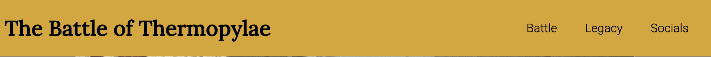
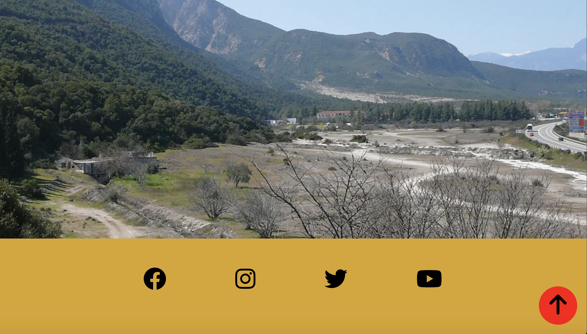
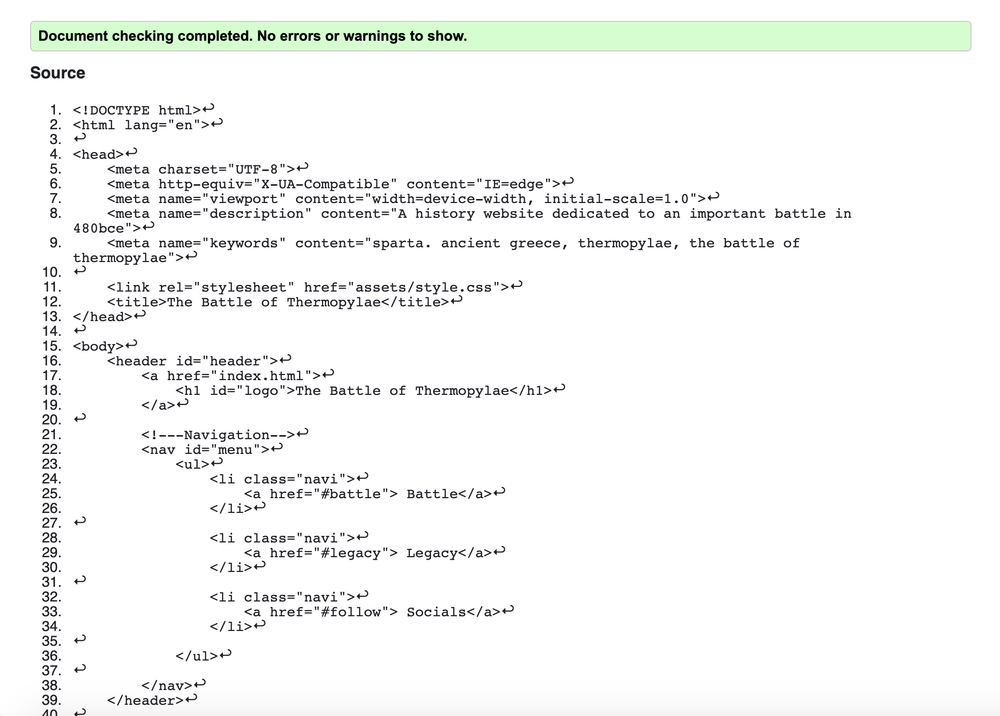
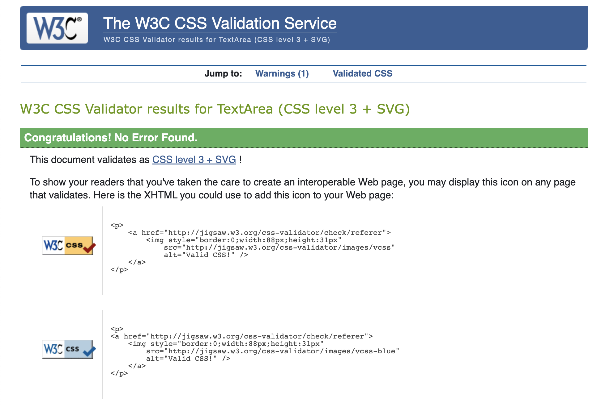

# Battle of Thermopylae Website - Project Lambda

Project Lambda is an informative history website focusing on the Battle of Thermopylae in 480BC.

The target audience for this website will be those looking to broaden there knowledge on Ancient Greek, or more specifically, Spartan history. 

My goal with this website is to engage with this target audience and anyone who will be interested in learning about the battle having heard of it in history lessons or films/documentaries, and want to learn more. 

[Live Link here](https://robrowno.github.io/project-lambda/)

---
## Website across different platforms

---
## My wireframe

I came up with my first wireframe and concept using the Balsamiq Wireframes Application that was suggested by Code Institute. 
This helped me to visualise my ideas and got me to think about how I might implement and style them. 

Using Balsamiq, I came up with three mediums for the website. A desktop, Tablet and Mobile rendering: 

### Desktop

### Tablet

### Mobile

---

## Features

* Navigation Bar
    - A responsive Navigational Header that allows the user to return to the top of the page by clicking the H1 Title or to quickly find segments of the website they wish to jump to. 
    - There are 3 options: Battle, Legacy and Socials. The Battle link takes the user to the 3 day battle section of the page. The Legacy link allows the user to jump to the aftermath of the battle to see how the battle has influenced history. The Socials link takes the user to the footer of the website to access the social media icons and follow the developer on any of those platforms. 
    - When the user hovers over the links, they underline to add a bit more functionality to the bar and to confirm to the user that the links to respond to taske them where they want to go.

* Hero Image 
    - A hero image of a picture depicting the battle at the top of the page between the header and the About section. Designed to draw the user in to find out more about thew battle. 

    

* About Section 
    - An About section describes the aim of my website to the reader between two hr lines. It's deisgned to brieftly take the reader's attention away to tell them why I made this website and what my goal is for the reader by the time the feel they want to leave the website. 
<!-- Screenshot -->

 * Belligerents 
    - This is split into two seperate areas. One describes the Greek Allied forces, the other, the Achaemenid-Persian forces. Seperating both areas of content is a div of 3 images under each block of text. This is to give the reader a good idea of what a typical soldier looked like and how the armies may have fought together in groups. 
<!-- Screenshot -->

 * Battle Section 
    - The battle section, which is linked in the Navigation, splits up the information about the battle in to 3 day blocks. The reader can see what happened on each day of the battle, before viewing a battle map below to see where the battles took place and how the troops travelled to get there.
<!-- Screenshot -->

* Legacy Section
    - The Legacy section, which is linked in the Navigation, shows the immediate aftermath of the battle and the Cultural influences on us today. I want the user to see where certain famous phrases come from, and how this event in history has shaped modern media such as films, documentaries, books and games that the reader may recognise. 

    - If the reader doesn't recognise them, I hope it encourages the reader to investigate further into the media out of curiosity. 
<!-- Screenshot -->

* Footer/Social-Network Bar
    - This section, which is also linked in the Navigation Bar, encourages the reader to follow the developer on the displayed social media icons. They are very recognisable icons that should intuitively be clicked on to lead the reader to the given websites. 

---

 ## Other Features to implement

 * In future, a link in the Nav bar to other related battles from the same period would be beneficial to the goals of the site and the reader, to give further context and detail to the battles referenced in my website. 

 * What I would do, is add a drop down link to the nav bar that contains links labelled by name of the battle (Marathon, Salamis, Plataea), and the reader would be taken to another page detailing that battle. 

 ---

## Testing

HTML tested with no errors found on: https://validator.w3.org/

---

CSS tested with no errors found on: https://jigsaw.w3.org/css-validator/

**When deploying the website, no obvious bugs have been found by myself so far.**

---
## Deployment

**Below are the steps to take to deploy this website:**

Project Lambda is deployed on Github. Follow the steps below to deploy a Github Repository through GitHub pages:

1. Select the repository that you want to deploy, and select the settings link at the top right of the menu bar (A 'cog' icon will show near it). 
2. Select the pages section on the vertical navigation bar on the left. 
3. On the Github pages tab, scroll to the Source area and change the "None" branch tab to "Main", followed by changing the folder selector to "Root". 
4. Finally, save this setting and refresh the site until you are presented with the following message in green: "Your site is published at (Your Github web address)"

### Forking your Repository 

You can fork your repository to create a copy of the original one. This allows you to make changes without altering the original repository. Take the steps below:

1. Find and select your chosen repository.
2. At the top right of the page, between the watch/unwatch tab and the star tab, select the "Fork" tab.
3. You will now find a copy of the same repository in your account. 

### Cloning a Repository

See steps below to make a local clone repository:

1. Find and select the chosen repository.
2. Select the "Code" button above the displayed repository files. 
3. Select and Copy the displayed link. 
4. In Gitpod, change the directory to the desired location. 
5. Type "git clone" in the terminal and paste the link, followed by pressing the Enter key on your keyboard. 
6. You have successfully created a local clone!
---

## Credits

### Information Sources:

Several other websites heavily influenced the information presented on my website. 

Namely, these online sources include:

- [Wikipedia (Source 1)](https://en.wikipedia.org/wiki/Battle_of_Thermopylae)
- [History of Yesterday](https://historyofyesterday.com/the-real-story-behind-the-300-spartans-760dfeb7e276)
- [ World History](https://www.worldhistory.org/thermopylae/)
- [Realm of History](https://www.realmofhistory.com/2017/01/23/10-facts-battle-of-thermopylae/)
- [Hellenic Art](https://www.hellenic-art.com/greco-persian-wars.html)
- [Wikipedia (Source 2)](https://en.wikipedia.org/wiki/Sparta_in_popular_culture)
- [Historynet](https://www.historynet.com/battle-of-thermopylae-leonidas-the-hero/)
- [Greek armour/weapons](https://classroom.synonym.com/ancient-greek-armor-weapons-during-battle-thermopylae-12579.html)
- [Hoplites](https://www.hoplites.org/the-achaemenidian-persian-army-490-430bc/)
- [Greek-City-Times](https://greekcitytimes.com/2020/08/20/the-battle-of-thermopylae/)

In the back of the comic book '300', which I mention in the Cultural Influence section of my page, there is a recommended reading list which I would like share for those that wish to further their understanding about the battle through other literature: 

- *The Hot Gates* by William Golding
- *The Histories* by Herodotus
- *Thermopylae: The Battle for the West* by Ernie Bradford 
- *The Western Way of War by Victor Davis* Hanson

---

### Icons & Fonts:
Icons used the social media were provided using [Font-Awesome](https://fontawesome.com/icons/youtube?s=brands). 
Chosen Fonts were selected from [Google-Fonts] (https://fonts.google.com/)

---
### Help from Peers:

I hit bumps along the way on this project, being my very first website. 
I couldn't have got it to where it is today without the help of the following people:

- My Code Institute Mentor: **Adegbenga Adeye**
- My London Coding Community Mentor: **Harry Dhillon**
- **Esteph**, from the London Coding Community, who took the time out of her day to help me with problems in my code
- **Alexey Kuzmis**, also from the London Coding Community, who helped with layout-idea brainstorming at the start of the project

---

### Other Credit: 

- Github Docs: helped me to expand my knowledge on README syntax: [Link](https://docs.github.com/en/get-started/writing-on-github/getting-started-with-writing-and-formatting-on-github/basic-writing-and-formatting-syntax)
-  W3 Schools: for CSS tutorials. I cannot recommend this enough: [Link](https://www.w3schools.com/css/default.asp)
- Coolers: A website that helped me to pair colours together in an appealing way: [Link](https://coolors.co/e3b505-95190c-b0b2b8-404e4d-cfd6ea)
- gokulkrishh on Github Gist: providing a fantastic boilerplate Media Query template for other users, like myself, to take inspiration from: [gokulkrishh-template](https://gist.github.com/gokulkrishh/242e68d1ee94ad05f488)

---
## Image Sources:

Thermopyles image : [Link](https://www.google.com/url?sa=i&url=https%3A%2F%2Fen.wikipedia.org%2Fwiki%2FThermopylae&psig=AOvVaw3B9__qq0rwp50I9TGZa7c8&ust=1645882325799000&source=images&cd=vfe&ved=0CAsQjRxqFwoTCIDgic37mvYCFQAAAAAdAAAAABAD)

Thermopylae image 2 : [Link](https://www.livius.org/pictures/greece/thermopylae/thermopylae-view-from-electricity-mast/)

Greek Hoplite Image: [Link](https://www.worldhistory.org/image/152/greek-hoplite/) - Originally published by Johnny Shumate and uploaded by Jan Van Der Crabben under the following license: Public Domain. 

Spartan Army Image: [Link](https://fineartamerica.com/shop/tapestries/hoplite)

Spara Image: [Link](https://www.quora.com/Which-would-win-the-battle-the-Imperial-Roman-Army-or-the-Persian-Achaemenid-Army-Why) - Image linked in a Quora thread. 

Hot Gates Battle Image: [Link](https://greekcitytimes.com/2020/08/20/the-battle-of-thermopylae/) - The image itself comes from a book titled "The Gates of Fire".

Hoplites & Spara Image: [Link](https://historyofyesterday.com/the-real-story-behind-the-300-spartans-760dfeb7e276) - credit is sourced to Wikimedia Commons.

Persian Cavalry Image: [Link](https://weaponsandwarfare.files.wordpress.com/2017/03/175c3b6f924e8bd63f919a4b571c6f44.jpg)

War map Image: By User:Bibi Saint-Pol - Own work. Data from Image:Perserkriege.jpg by Captain Blood, which uses the dtv-Atlas Weltgeschichte. Von den Anfängen bis zur Gegenwart, p. 56. Blank map from Image:Map greek sanctuaries-fr.svg., CC BY-SA 3.0, https://commons.wikimedia.org/w/index.php?curid=1724898

300 Image: [Link](https://wallpaperaccess.com/300-movie) - image from the movie '300' by Zack Snyder.

300 Comic Image: [Link](https://www.amazon.co.uk/300-Frank-Miller/dp/1569714029) - image of Comic Book '300' by Frank Miller.

Leonidas Monument Image: [Link](https://youingreece.com/thermopylae/leonidas-monument)

Thespian Monument Image: [Link](https://scottmanning.com/content/in-memory-of-the-700-thespians-at-thermopylae/)

Thermopylae Plaque Image: [Link](http://kiwihellenist.blogspot.com/2019/02/simonides.html)

---

## Final Thoughts

This project, my first proper adventure in to putting coding into practice, has been a thoroughly enjoyable experience. 
This has proved to be a great challenge to test what I know so far on my Code Institute journey. 
There were some tricky spots to overcome, but with the help of peers and my mentor, I have come out with a website that I can be proud of for a first endevour! 

6 weeks ago, I didn't know what HTML and CSS was. To get to a point now where I can code a basic website makes me beyond happy! To that end, Happy Coding, Readers! :)

